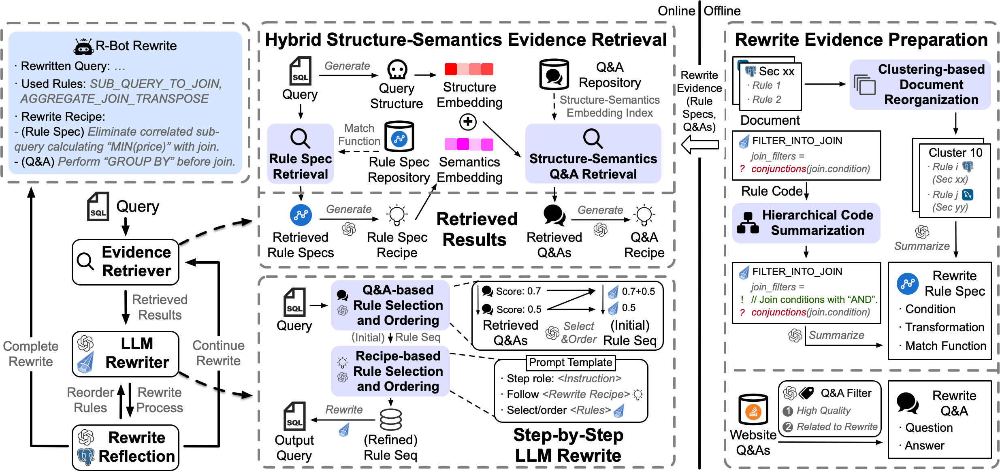

# R-Bot: An LLM-based Query Rewrite System

<p align="center">
    
</p>

R-Bot is an *LLM-based query rewrite system*, which extracts rewrite evidences from complex documents and codes, retrieves relevant evidences based on query structure and rewrite semantics similarities, and step-by-step guides LLM in selecting and ordering rewrite rules.

Key advantages include: (1) *high quality* using a specialized RAG algorithm, (2) *zero-shot robustness* with a vast pre-trained corpus and prepared evidences, (3) *executability and equivalence* ensured by the rewrite rules themselves.

## Installation

We have developed and tested *R-Bot* based on Ubuntu 22.04, PostgreSQL v14.13, Python 3.10, and OpenJDK 17.0.12 2024-07-16.

Clone this repository and install necessary dependencies:

```bash
pip install -r requirements.txt
```

## Quick Start

To get started with *R-Bot*, follow these steps:

### Step 1: Set Up R-Bot

First, set your OpenAI API key:

```python
import os
os.environ["OPENAI_API_KEY"] = "your-openai-api-key"
```

Second, modify [config.py](my_rewriter/config.py) to customize the *R-Bot* configuration:

```python
# Directory path to store database execution latencies of SQL queries.
CACHE_PATH = 'cache'

# Initialize LLM and prompt settings.
def init_llms(model_type: str) -> dict[str, str]:
    pass

# Initialize database settings.
def init_db_config(database: str) -> dict[str, str]:
    return {
        'host': '',
        'port': 5432,
        'user': '',
        'password': '',
        'dbname': database,
        'db': 'postgresql'
    }
```

### Step 2: Build Q&A Embedding Index
We implement our retrieval augmented generation (RAG) method based on the [LlamaIndex](https://github.com/run-llama/llama_index) framework, and build our Q&A embedding index on the vector database [Chroma](https://github.com/chroma-core/chroma).
```bash
cd rag
unzip stackoverflow-rewrite-embed.zip
# Build structure-semantics Q&A index.
python3 rag_gen.py
# (Optional) Build structure-only Q&A index.
python3 rag_structure.py
# (Optional) Build semantics-only Q&A index.
python3 rag_semantics.py
```

### Step 3: Demonstrate R-Bot Performance on Benchmarks

First, download the three datasets used in our paper: [TPC-H](https://github.com/gregrahn/tpch-kit), [DSB](https://github.com/microsoft/dsb), [Calcite](https://github.com/eidos06/SlabCity/tree/main).

Second, after initializing database settings in the previous step, create six databases from the three datasets:

Database | Source
--- | ---
tpch10 | TPC-H 10x
tpch50 | TPC-H 50x
dsb10 | DSB 10x
dsb50 | DSB 50x
calcite10 | Calcite (40M rows, uniform dist)
calcite10zipf | Calcite (40M rows, Zipfian dist)

Third, run benchmarks:
```bash
cd my_rewriter
# Demonstrate performance of R-Bot and baselines on the six databases.
bash test.sh
# (Optional) Perform ablation studies of R-Bot.
bash test_ablation.sh
```

Fourth, view experimental results:

- `my_rewriter/`
  - `logs`: *R-Bot (GPT-4)* evaluation.
  - `logs_gpt3`: *R-Bot (GPT-3.5)* evaluation.
  - `logs_llm_only`: *GPT-4* evaluation.
  - `logs_llm_only_gpt3`: *GPT-3.5* evaluation.
  - `logs_learned_rewrite`: *LearnedRewrite* evaluation.
  - `logs_ablation`: Ablation studies of *R-Bot (GPT-4)*.

## Code Structure
- `calcite/`: Table schema and queries of Calcite dataset.
- `CalciteRewrite/`: Module for rewriting the query with selected rewrite rules based on [Apache Calcite](https://github.com/apache/calcite).
- `dsb/`: Table schema and queries of DSB dataset.
- `explain_rule/`
  - `calcite_rewrite_rules_structured.jsonl`: Rule specifications summarized from rewrite rule codes.
- `knowledge-base/`
  - `rule_cluster_summaries_structured.jsonl`: Rule specifications aggregated from rewrite documents.
  - `rule_cluster_funcs/`: Matching functions of aggregated rule specifications. 
- `my_rewriter/`: Module for step-by-step LLM rewrite.
- `rag/`: Module for hybrid structure-semantics evidence retrieval.
- `tpch/`: Table schema and queries of TPC-H dataset.

## Citation
Feel free to cite us ([paper link](https://www.vldb.org/pvldb/volumes/18/paper/R-Bot%3A%20An%20LLM-based%20Query%20Rewrite%20System)) if you like this project.

```bibtex
@article{sun2025rbot,
  title={R-Bot: An LLM-based Query Rewrite System},
  author={Zhaoyan Sun, Xuanhe Zhou, Guoliang Li, Xiang Yu, Jianhua Feng, Yong Zhang},
  journal={Proceedings of the VLDB Endowment},
  volume={18},
  number={12},
  pages={5031--5044},
  year={2025},
  publisher={VLDB Endowment}
}
```
